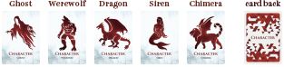
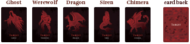
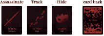
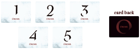
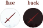
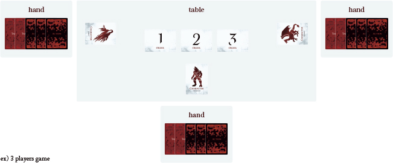
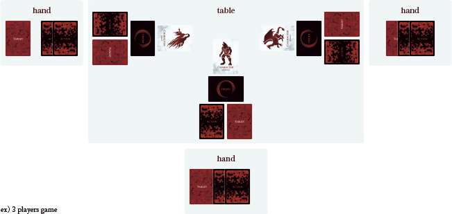
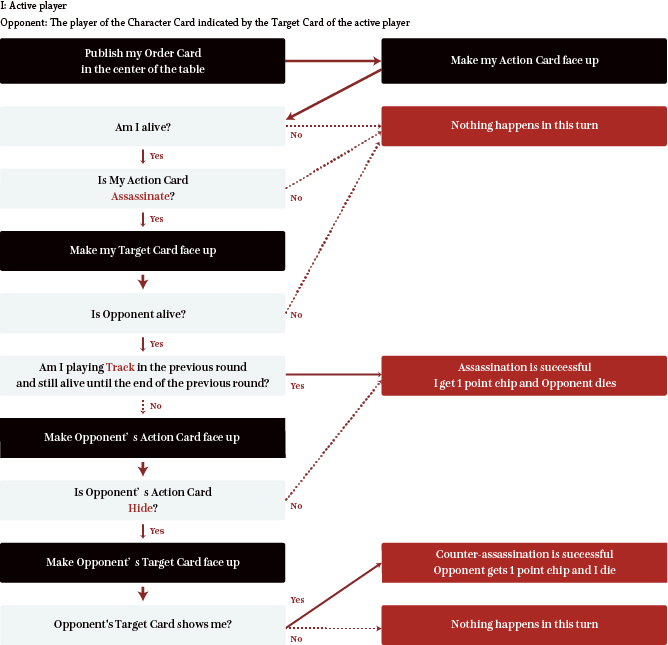

# Assassin's Crisis Rulebook

## Title

Assassin's Crisis

[https://ac.migi.site/en/](https://ac.migi.site/en/)

## Overview

All players are **ASSASSINS**!  
Use **Assassinate**, **Track**, and **Hide** cards, To survive **the psychological battle** of killing and killing!

## Components

### Character Card

5 types, 1 each  

### Target Card

5 types, 4 each  

### Action Card

3 types, 5 each   

### Order Card

5 types, 1 each   

### Point Chip

11 chips  

## Story

You are the King's assassin. At the request of the king, you killed many political enemies.  
Tonight, you receive an extraordinary request from the king.  
There are rumors that one of the king's assassins is connected to a political enemy and is aiming for the king's life, so he wants to kill the other assassins prior to be killed. The King has 5 assassins who is dubbed "Ghost", "Siren", "Werewolf", "Dragon", and "Chimera", including you.  
The assassins are professional as like you. Unlike the usual target, there is a possibility of counterattack.

Meanwhile, the other assassins were receiving similar requests from the king at that time.

## Object

This game is an analog game in which everyone becomes an assassin and plays against other players.  
You can win by assassinating other player three times, but you must also think that they will assassinate you.  
Use the Assassinate card to try to assassinate other players, the Track card to ensure assassination, and the Hide card to aim at the counter while preventing assassination from other players, to aim to win the game.

## Set-up

### Cards prepared for each player's hand

#### 1 Character Card

Choose one of your favorite Character Cards, and put them out vertically in front of you.  
There is no difference in game play between Character Card types.

#### Each Target Cards other than your character

Take one Target Card of each player's Character Card other than yourself, and keep it in your hand so that other players can not see it.
>ex) If your Character Card is "Ghost" and the other player is "Werewolf" or "Dragon" in a 3-player game, you will receive the Target Cards of "Werewolf" and "Dragon".

#### 3 Action Cards one by one

Keep this as a hand so that it is not seen by other players.

### On the table

#### Order Cards for the number of players

>ex) When playing with 3 players, Order Cards of "1", "2" and "3"

#### Point Chips

### cf) Placement at game start

## Flow

The following 3 phases of "**A. Order decision**", "**B. Action decision**", and "**C. Action execution**" are defined as 1 round, and the round is repeated until someone reaches the game termination condition.

### A. Order decision phase

- **The processing method differs between the first round and the second and subsequent rounds.**
- Check the Order Card only for yourself, and **DO NOT** disclose it to other players.
- When all players have got the Order Card, proceed to the next phase.

#### The first round processing

Shuffle the Order Card and give out one to each player.

#### The second and subsequent rounds

Give each player the ability to act in the order of "Track", "Hide", and "Assassinate" in the Action Card from the previous round.
>ex) In the case of 5 players, in the previous round 2 players were playing "Track", 1 was playing "Hide", and 2 were playing "Assassinate".
>Shuffle the Order Cards "1" and "2" to the two players who played "Track", give the Order Card "3" to the player who played "Hide", and Shuffle the Order Cards "4" and "5" to the two players who played "Assassinate".

>**CAUTION!** If the player who played "Track" in the previous round dies during the previous round, the effect of "Track" will not be activated in this round, but the turn will be quicker.

### B. Action decision phase

- All players place 1 Target Card and 1 Action Card **FACE DOWN**.
- When all players have finished, proceed to the next phase.

#### Action Cards meaning and features

- Assassinate card
  - Assassinate the player of the Target Card played at the same time.
  - Assassination is successful if the target action is anything other than "Hide".
  - The turn of the next round is delayed.
- Track card
  - Track the player of the Target Card played at the same time.
  - If you survived this round, assassination succeeds when you play "Assassinate" in the next round, even if your opponent is "Hide".
  - The turn of the next round is quicker.
- Hide card
  - Watching the Target Card player while hiding.
  - Disable assassination if assassinated by another player.
  - Also, if the Target Card of the player who assassinated was played, it becomes a counter assassination and conversely assassinates that player.
  - However, if the player who assassinated has played "Track" in the previous round and was alive, he will be assassinated even if you played "Hide"

>**CAUTION!** If you were alive with a "Track" in the previous round, the Target Card will remain face down, and will remain that way (the Target Card cannot be changed).
Place a new "Assassinate" or "Hide" Action Card next to the "Track" card in the table.

#### cf) Placement at the end of Action decision phase

### C. Action execution phase

From the player who has the Order Card "1" to the next player in numerical order, the result is processed.

#### Processing flow in Action execution phase

- Players who succeed in assassination (including counter assassination) in the Action Execution Phase receive 1 Point Chip.
- Players who died during the action execution phase (assassinated, counter-assassed players) turn their Character Cards holizontal.
- When a player who satisfies the game termination condition appears during the action execution phase, the game ends with that player as the winner.
- When all players have completed their executions, proceed to the round end process.

### Round end proces

- If the player who played the "Track" in this round is alive, leave the Action Card (face up) and the Target Card (face down) in play.  
- Return the other Action Cards and Target Cards to their hands.  
- Collect the Order Card.  
- Return the Character Card of the assassined player to vertical orientation.
- Proceed to the next round.

## Termination condition

If any player has succeeded in assassinating 3 times (after scoring 3 Point Chips), the game ends at that point and the player wins.

## In the case of two players

Play without a Target Card. The processing at the time of executing the action is the same as the case of 3 or more.

## Selection rule: Battle Royale mode

The normal rule is that the player who succeeded in assassination three times wins, but in this rule the player who has been assassinated three times drops out and the player who survived until the last one is the winner.  
Let the assassinated player get Point Chips. (Please use the back of the Point Chip)  
When two players are left, the rules for two players are applied.

## FAQ

### I played a "Track" in the previous round and was killed by another player. If so, what will happen to the Order Card distribution for this round?

The distribution of the Order Card is not related to alive or death in the previous round.  
In this round, the turn is quicker (Order Cards with lower numbers are given priority).

### I played "Track" in the previous round and still alive. Can I play "Hide" in this round?

yes, it's possible.  

### I played "Track" in the previous round and still alive. If another player attacks me with "Assassinate" under the same conditions, will a counter assassination targeting that player occur?

No, you are assassinated.

### The title of this game is similar to something other game, Right?

Uh huh.

## Designer

### Game Designer

Takanobu Migitera
[@migi](https://twitter.com/migi)

### Graphic Designer

maasa
[@i_maasa](https://twitter.com/i_maasa)

## Version history

- ver1.0.0 (2020/3/17)
  - release