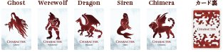
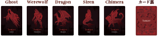
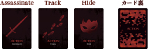
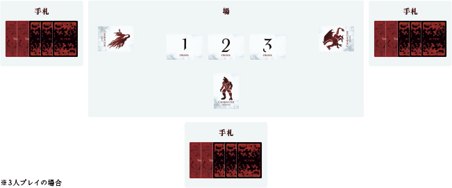
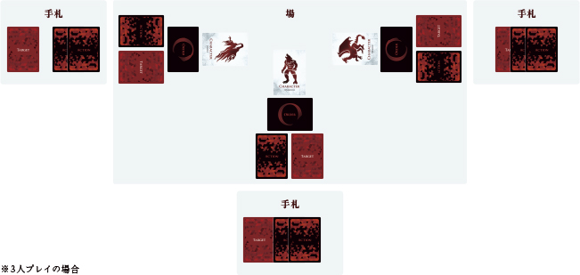
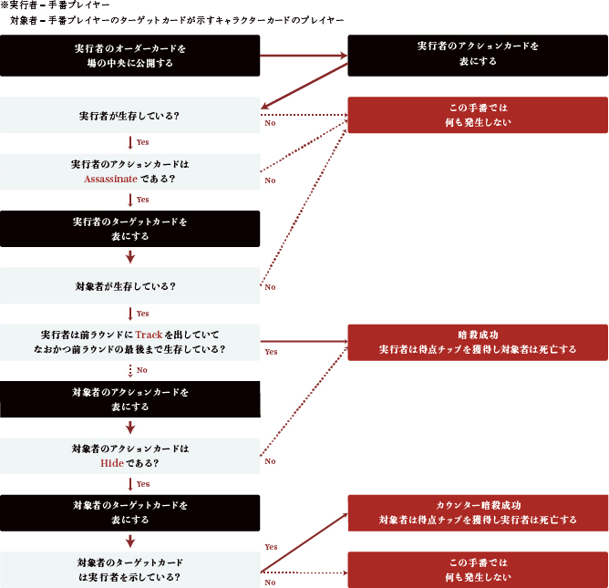

# アサシンクライシス ルールブック

## タイトル

Assassin's Crisis (アサシンクライシス)

[https://ac.migi.site](https://ac.migi.site)

## ゲーム概要

プレイヤー全員が**暗殺者**！  
**暗殺**・**追跡**・**潜伏**のカードを使いこなし殺し殺されの**心理戦**を生き残れ！

## セット内容

### キャラクターカード

5種 各1枚  

### ターゲットカード

5種 各4枚  

### アクションカード

3種 各5枚  

### オーダーカード

5種 各1枚  

### 得点チップ

11枚  

## ストーリー

あなたは王お抱えの暗殺者。王から依頼を受け、数々の政敵を闇に葬ってきた。  
そんなあなたは今夜、今までとは一味違う依頼を王から受け取る。  
王お抱えの暗殺者の一人が政敵とつながり、王の命を狙っているという噂があるため、先手を打って他の暗殺者を屠ってほしいというのだ。王お抱えの暗殺者はあなたを含む5人、通り名は「Ghost」「Siren」「Werewolf」「Dragon」「Chimera」。  
いずれ劣らぬ手練れたち。いつものターゲットとは違い、下手をすれば返り討ちの可能性もある……。  

一方その頃、他の暗殺者たちも王から同様の依頼を受けたところだった。

## ゲームの目的

このゲームは全員がアサシン（暗殺者）となって他のプレイヤーと対戦して遊ぶゲームです。
自分以外のプレイヤーを3回暗殺することで勝利できますが、他のプレイヤーも自分を暗殺しに来ることを考えながらプレイしなければなりません。  
他のプレイヤーに暗殺を試みる「Assassinate」カード、暗殺を確実なものにする「Track」カード、他のプレイヤーからの暗殺を防ぎつつカウンターを狙える「Hide」カードの3種類のカードを使いこなし、勝利を目指しましょう。

## ゲームの準備

### 各プレイヤーの手元に用意するカード

#### キャラクターカード 1枚

それぞれ好きなキャラクターカードを1枚選んで自分の前に表向きに縦にして出しておきます。  
キャラクターカードの種類によるゲームプレイ上の優劣はありません。

#### 自分のキャラクター以外のターゲットカードを1枚ずつ

自分以外の他のプレイヤーのキャラクターカードを各プレイヤー1枚ずつ受け取り、手札として他のプレイヤーに見られないように手元に保持しておきます。

>例）3人プレイで自分のキャラクターカードが「Ghost」で他のプレイヤーが「Werewolf」「Dragon」の場合は、「Werewolf」「Dragon」のターゲットカードを受け取ります。

#### アクションカード3種を1枚ずつ

手札として他のプレイヤーに見られないように手元に保持しておきます。

### 場に用意するもの

#### プレイヤー人数分のオーダーカード

>例）3人でプレイする場合は「1」「2」「3」のオーダーカード

#### 得点チップ

### 参考 ゲーム開始時の配置

## ゲームの進行

下記の「**A. 手番決定**」「**B. アクション決定**」「**C. アクション処理**」の3フェイズを1ラウンドとして、終了条件を満たすプレイヤーが現れるまでラウンドを繰り返す。

### A. 手番決定フェイズ

- **第1ラウンドと第2ラウンド目以降とで、処理の仕方が異なります**。
- 獲得したオーダーカードは自分のものだけは確認して、**他のプレイヤーには公開しない**ようにします。
- 全プレイヤーがオーダーカードを獲得したら次のフェイズに進みます。

#### 【第1ラウンドの処理】

オーダーカードをシャッフルしてプレイヤー全員に1枚ずつ配ります。

#### 【第2ラウンド目以降の処理】

前ラウンドに出したアクションカードが「Track」「Hide」「Assassinate」の順に早く行動できるようにします。

>例） 5人プレイで前ラウンドにおいて2人が「Track」、1人が「Hide」、2人が「Assassinate」を出していた場合は、「Track」を出していたプレイヤー2人にオーダーカード「1」「2」をシャッフルして渡し、「Hide」を出していたプレイヤーにオーダーカード「３」　を渡し、「Assassinate」を出していた2人にオーダーカード「4」「5」をシャッフルして渡す。

>注意) 前ラウンドで「Track」を出したプレイヤーが前ラウンド中に死亡していた場合、今ラウンドで「Track」の効果は発動しませんが、手番は早くなります。

### B. アクション決定フェイズ

- 全プレイヤーがターゲットカードとアクションカードのそれぞれ1枚を裏向きに**伏せて**出します。
- 全プレイヤーが出し終わったら次のフェイズに進みます。

#### アクションカードの意味と特徴

- Assassinateカード
  - 同時に出したターゲットカードのプレイヤーを**暗殺**
  - ターゲットのアクションが「Hide」以外の場合は暗殺が成功
  - 次のラウンドの手番が遅くなる
- Trackカード
  - 同時に出したターゲットカードのプレイヤーを**追跡**
  - このラウンドで最後まで生存していた場合、次のラウンドで「Assassinate」を出すと相手が「Hide」を出していても暗殺が成功
  - 次のラウンドの手番が早くなる
- Hideカード
  - **潜伏**しつつ、同時に出したターゲットカードのプレイヤーを警戒
  - 他のプレイヤーから暗殺を受けた場合その暗殺を無効化する
  - また、暗殺をしてきたプレイヤーのターゲットカードを同時に出していた場合、カウンター暗殺となり逆にそのプレイヤーを暗殺する
  - ただし、暗殺をしてきたプレイヤーが前ラウンドで「Track」を出していてなおかつ生存していた場合は自分が「Hide」を出していても暗殺されてしまう

>注意）前ラウンドで「Track」を出して生存していた場合、ターゲットカードは伏せたままになっていますがそれはそのままにしておき（ターゲットカードの変更は不可）、表になっている「Track」のカードの横に新たに「Assassinate」か「Hide」のアクションカードを伏せて出します。

#### 参考 アクション決定フェイズ終了時の配置


### C. アクション実行フェイズ

オーダーカードの1を持っているプレイヤーから数字の順に手番プレイヤーとなり、結果を処理していきます。

#### アクション実行フェイズにおける処理フロー



- アクション実行フェイズにおいて暗殺（カウンター暗殺を含む）を成功させたプレイヤーは得点チップを1つ受けとります。
- アクション実行フェイズにおいて死亡したプレイヤー（暗殺された、カウンター暗殺されたプレイヤー）はキャラクターカードを横向きにします。
- アクション実行フェイズ中にゲーム終了条件を満たしたプレイヤーが現れた時点でそのプレイヤーを勝者としてゲームは終了します。
- 全プレイヤーの手番が終わったらラウンド終了処理に進みます。

### ラウンド終了処理

- このラウンドで「Track」を出したプレイヤーが生存している場合、アクションカード(表向き)とターゲットカード(裏向き)は場に出したままにします。  
- それ以外のアクションカードとターゲットカードをそれぞれの手札に戻します。  
- オーダーカードを回収します。  
- 暗殺されたプレイヤーのキャラクターカードを縦向きに戻します。
- 次のラウンドに進みます。
## ゲーム終了条件

いずれかのプレイヤーが暗殺を3回成功させたら（得点チップを3枚獲得したら）その時点でゲームは終了し、該当プレイヤーが勝利します。

## 2人プレイの場合

ターゲットカードを使わずにプレイします。アクション実行時の処理は3人以上の場合と同様です。

## 選択ルール: バトルロイヤルモード

通常ルールでは「3回暗殺を成功したプレイヤーが勝利」というルールですが、このルールでは3回暗殺されたプレイヤーは脱落し、最後の1人になるまで生き残っていたプレイヤーが勝利者となります。  
暗殺されたプレイヤーが得点チップを獲得するようにします。（得点チップの裏を利用してください）  
残り2人になった際のルールは2人プレイの場合のルールが適用されます。

## FAQ

### 前ラウンドにTrackカードを出していましたが、他のプレイヤーから殺害されました。その場合、今回のラウンドのオーダーカードの配り方はどうなりますか？

オーダーカードの配り方は前ラウンドでの生存・死亡に関係しません。  
今回のラウンドでは手番は早くなります（低い数字のオーダーカードが優先して配られます）。

### 前ラウンドでTrackカードを出していてなおかつ生存していました。今回のラウンドでHideカードを出すこともできますか？

可能です。  

### 前ラウンドでTrackカードを出していてなおかつ生存していました。他のプレイヤーも同条件でAssassinateカードで自分を攻撃した際、そのプレイヤーをターゲットとしたカウンター暗殺は発生しますか？

発生しません。  

### タイトルが何かのゲームっぽくないですか？

そうですね。

## デザイナー

### ゲームデザイナー

右寺 隆信
[@migi](https://twitter.com/migi)

### グラフィックデザイナー

maasa
[@i_maasa](https://twitter.com/i_maasa)

## バージョン履歴

- ver1.0.0 (2020/3/17)
  - 公開